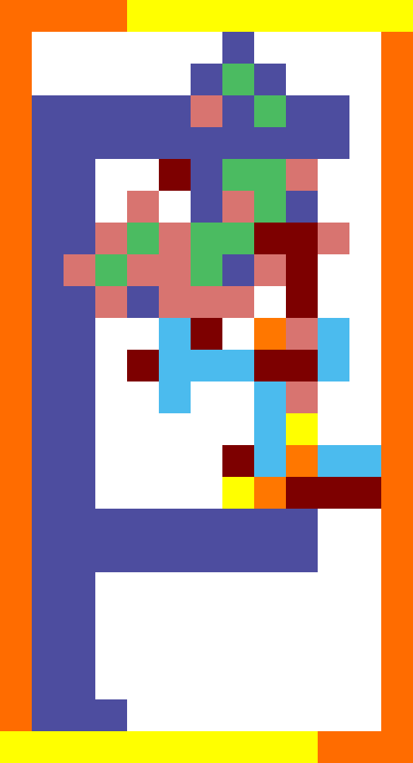

# ⊦ Turnstyle

Turnstyle is a programming language loosely inspired by [Piet].

However, where Piet leans towards a stack machine, Turnstyle takes inspiration
from [Lambda calculus] instead.

[Piet]: https://www.dangermouse.net/esoteric/piet.html
[Lambda calculus]: https://en.wikipedia.org/wiki/Lambda_calculus

This repository contains the language specification and a reference
implementation.

## Specification

The program is encoded as an image.

### Program flow

At every program step we consider the **Turnstyle shape** of the pixels
surrounding the current **position** and facing the current **heading**.
The initial heading is **right**.

Illustrated for all four headings:

All further illustrations in the specification assume we are heading right.

We use the following names to refer to the four pixels that make up the
Turnstyle: **L**eft, **C**enter, **F**ront, and **R**ight.

To evaluate an **expression**, we consider the colors of the four pixels.
Note that Turnstyle programs can use _any colors_, as long as we can compare
two colors for equality.  This gives us **15 unique patterns**.
The pattern determines the kind of expression.

### Variables

In Turnstyle, variables are _colors_.
A variable evaluates to the value assigned to the color indicated by the circle.

### Lambda Abstraction

Lambda abstraction constructs the anonymous function _(λv.e)_, where _e_ is the
expression at the solid arrow (→) and the variable _v_ is the color of the
pixel indicated with the circle.  Note that _e_ is parsed using a different
heading

### Function application

Function application evaluates the expression _(f x)_, where _f_ is the
expression at the solid arrow (→) and _x_ is the expression at the dashed
arrow (⇢).

If you visualize standing on the image and looking towards the front, the
left-hand side of the application will always be to the left of the right-hand
side of the application.

### Symbols

Symbols encode literals in the program.  We compare the relative **areas** of
the left, front and right pixels.

An **area** is defined as the number of pixels a contiguous color region.
Pixels of the same color that only touch diagonally are **not** considered
contiguous.

 -  If _area(L) ≥ area(R)_, the Turnstyle evaluates to a **numerical** literal
    of the integer value _area(F)_.
 -  Otherwise, _area(L) < area(R)_ evaluates to a  **primitive function**.
    In this case, _area(R) - area(L)_ determines the **primitive opcode**,
    and _|area(F) - area(R)|_ determines the **primitive mode**.

#### Primitives

This is an overview of the different primitive functions and what they do.

| Primitive opcode | Primitive mode | Primitive       |
| ---------------- | -------------- | --------------- |
| 1                | 0              | `input_number`  |
| 1                | 1              | `input_char`    |
| 2                | 0              | `output_number` |
| 2                | 1              | `output_char`   |
| 3                | 0              | `add`           |
| 3                | 1              | `subtract`      |
| 3                | 2              | `multiply`      |
| 3                | 3              | `divide`        |
| 4                | 0              | `lt`            |

 -  _(`input_number` k)_ reads a number `x` from `stdin`, and then evaluates
    _(k x)_.
 -  _(`input_char` k)_ reads a character `c` from `stdin`, and then evaluates
    _(k c)_.
 -  _(`output_number` x k)_ outputs `x` as a number to `stdout`, and then
    evaluates _k_.
 -  _(`output_char` x k)_ outputs `x` as an Unicode character to `stdout`, and
    then evaluates _k_.
 -  _((`add` x) y)_ evaluates to _x + y_.
 -  _((`subtract` x) y)_ evaluates to _x - y_.
 -  _((`multiply` x) y)_ evaluates to _x * y_.
 -  _((`divide` x) y)_ evaluates to _x / y_.
 -  _((((`lt` x) y) k) l)_ evaluates _k_ if _x < y_, and _l_ otherwise.
    You can also consider this as _((`lt` x) y)_ evaluating to a church-encoded
    boolean.

#### Identity

For all other patterns, we evaluate the expression at the Turnstyle indicated by
the arrow (→).  You can visualize this as following the color of the line.

## Examples

Returns exit code 0 (_1 - 1_).

Note: broken initial position.

The famous Y combinator _λf. (λx. f (x x)) (λx. f (x x))_.

Embeds the Y combinator to continuously write `F` to the terminal.

## Design Principles

 -  Lean towards pixel art but allow larger graphics as well
 -  Integers should be represented by areas, so 0 does not have a literal
    equivalent
 -  Allow relative creative in freedom in color choice and images
 -  But also ensure it is possible to create very dense images
 -  Allow users to implement and share code that looks like specific images
 -  A relatively large number of primops should be possible so we can
    actually write real programs.  This lead to using at least two numbers
    for primops.
