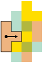
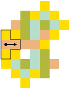
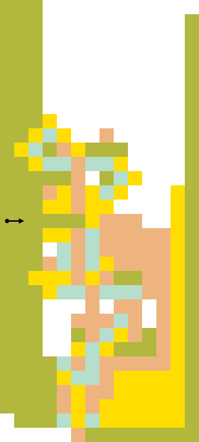
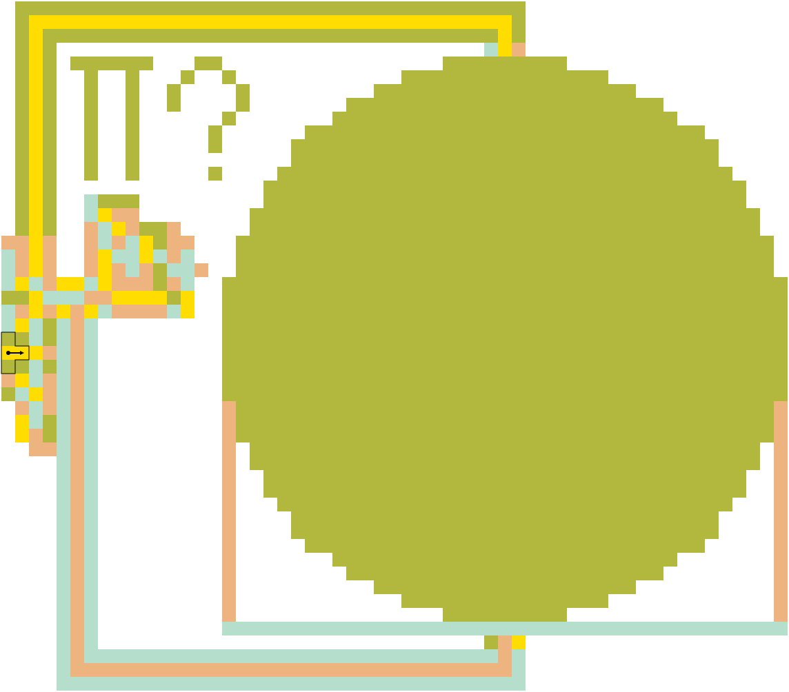

Turnstyle is a graphical [esoteric programming language] loosely inspired by
[Piet].  Both encode programs as images, however, the similarities end at the
syntax level.

Where Piet is really a stack machine in disguise, Turnstyle is an encoding of
the (untyped) [Lambda calculus].  This allows for building more reusable images
at a higher level of abstraction, while still keeping the specification small,
making it relatively easy to develop new interpreters.

This repository contains [the language specification](spec/) and a reference
implementation.

# Cheatsheet

# Examples

## 0

_((`num_sub` 1) 1)_ -- returns exit code 0:

## Y

_λf. (λx. f (x x)) (λx. f (x x))_ -- a somewhat symmetrical, reusable Y
combinator:

## ⊦

_(λf. (λx. f (x x)) (λx. f (x x))) (λf. (`out_char` ((`add` 34) ((`num_mul` 94) 94))) f)_
-- this reuses the Y combinator above to continuously print ⊦ to the terminal:

## π

Prints an approximation of _pi_ by comparing the circle to its diameter:

# Design Principles

 -  Lean towards pixel art but allow larger graphics as well
 -  Integers should be represented by areas, so 0 does not have a literal
    equivalent
 -  Allow relative creative in freedom in color choice and images
 -  But also ensure it is possible to create very dense images
 -  Allow users to implement and share code that looks like specific images
 -  A relatively large number of primops should be possible so we can
    actually write real programs.  This lead to using at least two numbers
    for primops.

[esoteric programming language]: https://en.wikipedia.org/wiki/Esoteric_programming_language
[Lambda calculus]: https://en.wikipedia.org/wiki/Lambda_calculus
[Piet]: https://www.dangermouse.net/esoteric/piet.html
