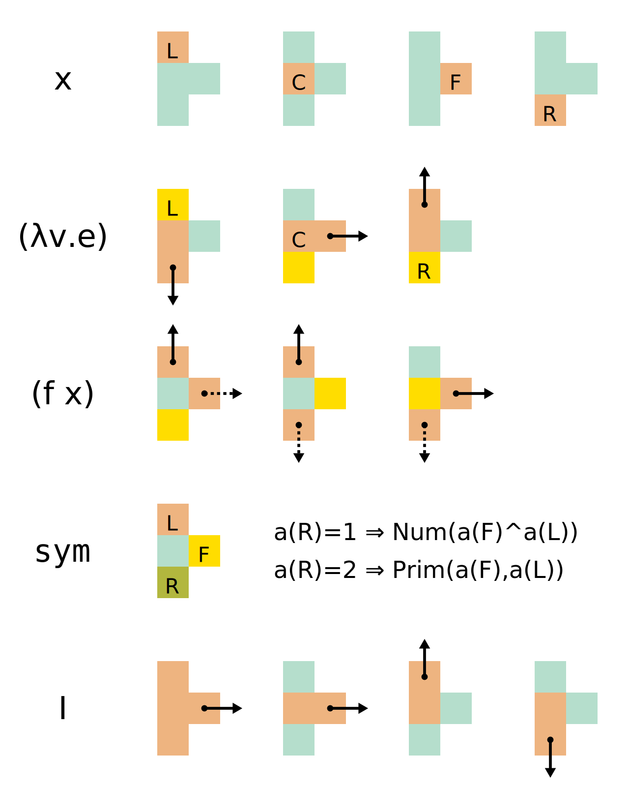
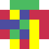
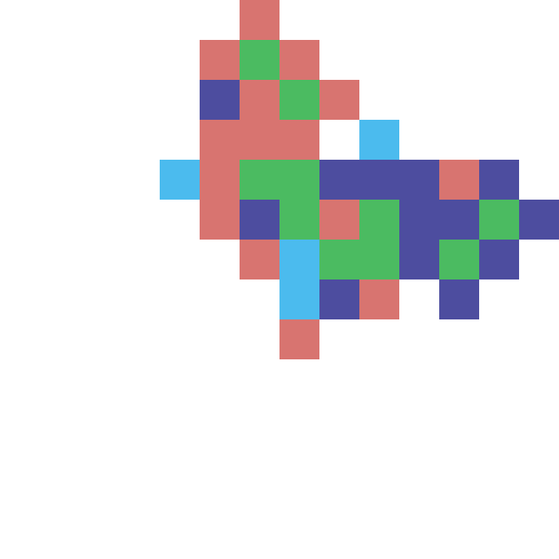
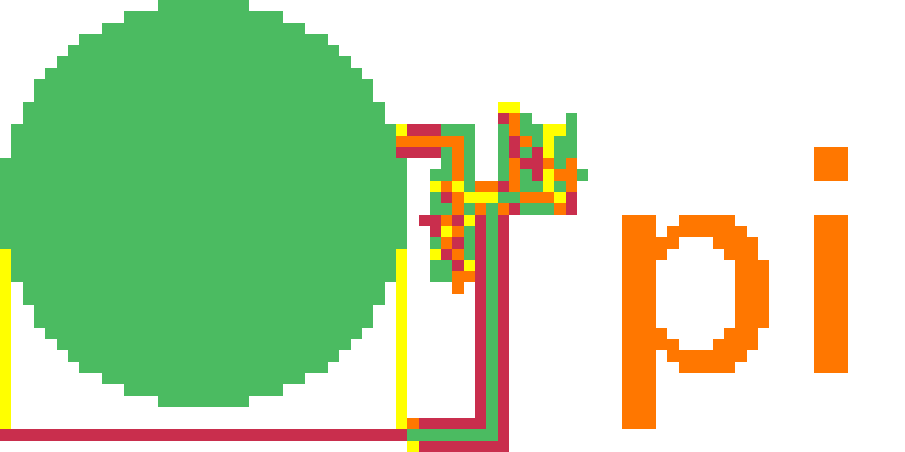

Turnstyle is an [esoteric programming language] loosely inspired by [Piet].

However, where Piet leans towards a stack machine, Turnstyle takes inspiration
from the (untyped) [Lambda calculus] instead.

This repository contains [the language specification](spec/) and a reference
implementation.

# Cheatsheet

# Examples

Returns exit code 0 by computing _((`subtract` 1) 1)_.

A somewhat symmetrical, reusable Y combinator:
_λf. (λx. f (x x)) (λx. f (x x))_.

This reuses the Y combinator above to continuously print ⊦ to the terminal:
_(λf. (λx. f (x x)) (λx. f (x x))) (λf. (`output_char` ((`add` 34) ((`multiply` 94) 94))) f)_.

Prints an approximation of _pi_ by comparing the circle to its diameter.

# Open questions

 -  How do we deal with EOF for input?  We could either have a second
    continuation; or we could have some special value (e.g. `-1`).
    The latter does not work for inputting numbers though...

# Design Principles

 -  Lean towards pixel art but allow larger graphics as well
 -  Integers should be represented by areas, so 0 does not have a literal
    equivalent
 -  Allow relative creative in freedom in color choice and images
 -  But also ensure it is possible to create very dense images
 -  Allow users to implement and share code that looks like specific images
 -  A relatively large number of primops should be possible so we can
    actually write real programs.  This lead to using at least two numbers
    for primops.

[esoteric programming language]: https://en.wikipedia.org/wiki/Esoteric_programming_language
[Lambda calculus]: https://en.wikipedia.org/wiki/Lambda_calculus
[Piet]: https://www.dangermouse.net/esoteric/piet.html
