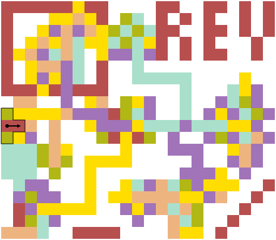

Turnstyle is a graphical [esoteric programming language] loosely inspired by
[Piet].  Both encode programs as images, however, the similarities end at the
syntax level.

Where Piet is really a stack machine in disguise, Turnstyle is an encoding of
the (untyped) [Lambda calculus].  This allows for building more reusable images
at a higher level of abstraction, while still keeping the specification small,
making it relatively easy to develop new interpreters.

This repository contains [the language specification](spec/), a reference
implementation in Haskell, and a
[simple JavaScript implementation](turnstyle.js).

# Specification

The cheatsheet below provides a high-level overview, for more details please
consult [the Turnstyle Language Specification](spec/).

# Examples

The starting Turnstyle shape is outlined.  Click on the examples to run them.

## pi

Prints an approximation of _pi_ by comparing the circle to its diameter:

## rev

Uses a [Y combinator] (indicated by the red rectangle in the top left)
and [continuation-passing style] to implement the Unix `rev` program.

## loop

Of course, fixed-point combinators are a primitive tool necessary to compensate
for the limitations of one-dimensional programming.  In two-dimensional
programs, we can achieve recursion using a more visually intuitive approach.
This program prints the sequence of natural numbers:

# Design Principles

 -  Lean towards pixel art but allow larger graphics as well
 -  Integers should be represented by areas, so 0 does not have a literal
    equivalent
 -  Allow relative creative in freedom in color choice and images
 -  But also ensure it is possible to create very dense images
 -  Allow users to implement and share code that looks like specific images
 -  A relatively large number of primops should be possible so we can
    actually write real programs.  This lead to using at least two numbers
    for primops.

[continuation-passing style]: https://en.wikipedia.org/wiki/Continuation-passing_style
[esoteric programming language]: https://en.wikipedia.org/wiki/Esoteric_programming_language
[Lambda calculus]: https://en.wikipedia.org/wiki/Lambda_calculus
[Piet]: https://www.dangermouse.net/esoteric/piet.html
[Y combinator]: https://en.wikipedia.org/wiki/Fixed-point_combinator
