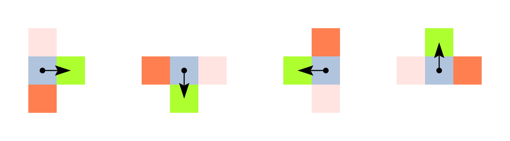
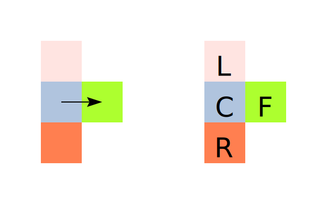
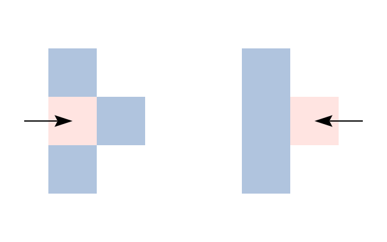
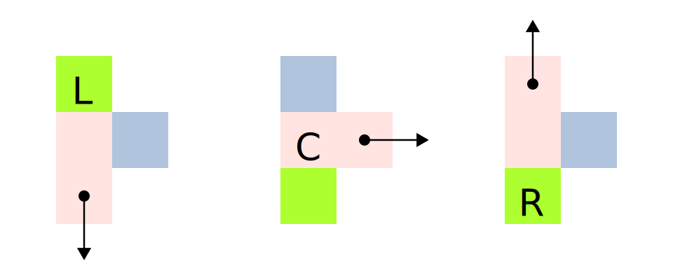
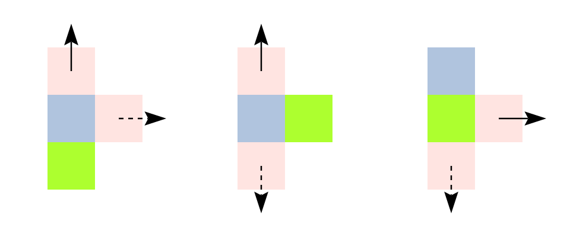
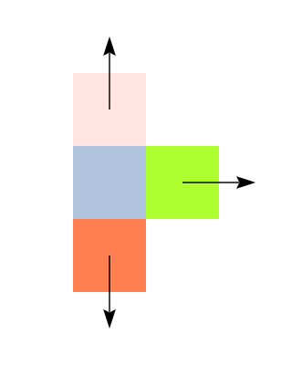
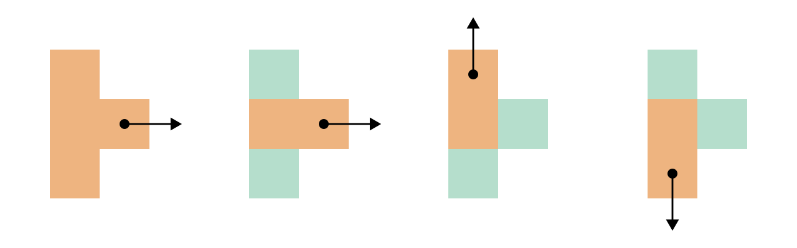

# Specification

The program is encoded as an image.

## Syntax

Turnstyle programs are evaluated by reading and evaluating **expressions** from
the image.  An expression is read using a given **position** (represented as
integral _(x, y)_ coordinates) and **heading** (right, down, left or up).

The top-level expression of a program is found at the center of the left side of
the image _(0, floor (image height / 2))_, and the initial heading is **right**.

To read an expression, we consider the **Turnstyle shape** of the pixels
surrounding the current **position** and facing the current **heading**.
If any of these four pixels lies outside of the image, the program should
terminate with an error.

Here is the Turnstyle shape illustrated for all four headings, with the current
position indicated by the small circle, and the heading represented using an
arrow:

For brevity, in all further illustrations in the specification we will assume we
are heading right.

We use the following names to refer to the four pixels that make up the
Turnstyle shape: **L**eft, **C**enter, **F**ront, and **R**ight.

Turnstyle programs can use _any colors_, as long as we can compare two colors
for (in-)equality.  This gives us **15 unique patterns**.  Here is a cheatsheet:

The pattern determines the expression that we read evaluate.  There are five
different kinds supports five expressions:

1.  Variables
2.  Lambda abstraction
3.  Function application
4.  Symbols (primitive operations and numeric literals)
5.  Identity (no-ops)

## Variables

In Turnstyle, we use _colors_ as variable names.  Depending on the pattern,
we pick the color of the pixel indicated by the letters LCFR:

This evaluates to the value assigned to the variable.  If the variable is
unassigned, the program should terminate with an error.

## Lambda abstraction

Lambda abstraction evaluates to the anonymous function _(λv.e)_, where the
variable _v_ is the color of the pixel indicated with the letters LCR, and _e_
is the expression at the Turnstyle shape indicated by the arrow.

## Function application

Function application evaluates the expression _(f x)_,
where _f_ is the Turnstyle shape indicated by the solid arrow (→)
and _x_ is the Turnstyle shape indicated by the dashed arrow (⇢).

If you visualize standing on the image and looking towards the front, the
left-hand side of the application will always be to the left of the right-hand
side of the application.

## Symbols

Symbols encode literals in the program.  We compare the relative **areas** of
the left, front and right pixels.

An **area** is defined as the number of pixels a contiguous color region.
Pixels of the same color that only touch diagonally are **not** considered
contiguous.

 -  If _area(L) ≥ area(R)_, the Turnstyle evaluates to a **numeric** literal
    of the integer value _area(F)_.
 -  Otherwise, _area(L) < area(R)_.  the Turnstyle evaluates to a
    **primitive function**.
    In this case, _area(R) - area(L)_ determines the **primitive opcode**,
    and _abs(area(F) - area(R))_ determines the **primitive mode**.

## Primitives

This is an overview of the different primitive functions and what they do.

| Opcode | Mode | Primitive       |
| ------ | ---- | --------------- |
|      1 |    0 | `input_number`  |
|      1 |    1 | `input_char`    |
|      2 |    0 | `output_number` |
|      2 |    1 | `output_char`   |
|      3 |    0 | `add`           |
|      3 |    1 | `subtract`      |
|      3 |    2 | `multiply`      |
|      3 |    3 | `divide`        |
|      4 |    0 | `lt`            |

 -  _(`input_number` k)_ reads a number `x` from `stdin`, and then evaluates
    _(k x)_.
 -  _(`input_char` k)_ reads a character `c` from `stdin`, and then evaluates
    _(k c)_.
 -  _(`output_number` x k)_ outputs `x` as a number to `stdout`, and then
    evaluates _k_.
 -  _(`output_char` x k)_ outputs `x` as an Unicode character to `stdout`, and
    then evaluates _k_.
 -  _((`add` x) y)_ evaluates to _x + y_.
 -  _((`subtract` x) y)_ evaluates to _x - y_.
 -  _((`multiply` x) y)_ evaluates to _x * y_.
 -  _((`divide` x) y)_ evaluates to _x / y_.
 -  _((((`lt` x) y) k) l)_ evaluates _k_ if _x < y_, and _l_ otherwise.
    You can also consider this as _((`lt` x) y)_ evaluating to a
    [church-encoded][Church encoding] boolean.

## Identity (no-op)

For all other patterns, we evaluate the expression at the Turnstyle indicated by
the arrow (→).  You can visualize this as following the color of the line.

## Semantics

### Precision

[Scheme Exactness]

> Scheme numbers are either exact or inexact. A number is exact if it was written as an exact constant or was derived from exact numbers using only exact operations. A number is inexact if it was written as an inexact constant, if it was derived using inexact ingredients, or if it was derived using inexact operations. Thus inexactness is a contagious property of a number.

[Church encoding]: https://en.wikipedia.org/wiki/Church_encoding
[Scheme Exactness]: https://www.cs.cmu.edu/Groups/AI/html/r4rs/r4rs_8.html#SEC52
